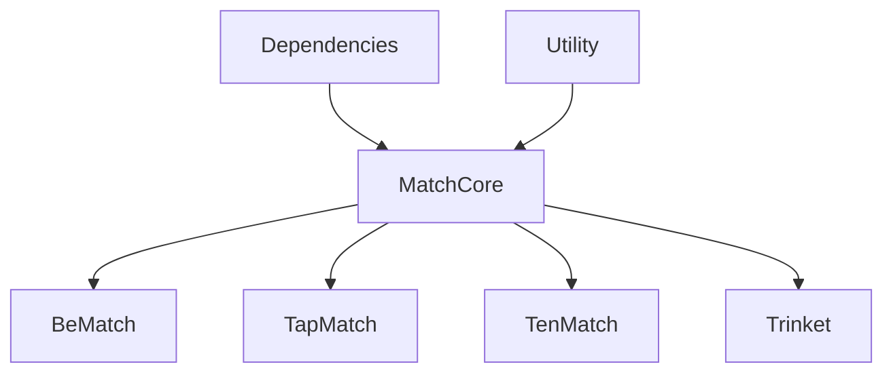

# iOS Apps

  
  

# About

We currently develop and manage four different brands. While the UI details vary slightly between brands, all of them are ID exchange apps built on the same core business logic. 
Since we operate with a very small team, it would be challenging to develop and manage each brand as a completely independent app. 
To address this, we've adopted an approach where the business logic is shared across all brands, and only the UI is implemented separately. 

- Utility
  - A package that consolidates code related to utilities.
- Dependencies
  - A collection of code using swift-dependencies.
  - This code is decoupled from the main application, making it reusable even when developing entirely different products.
  - We've been reusing this dependencies code from two previous products.
- BeMatch (App UI Package)
  - The UI code for BeMatch.
- TapMatch (App UI Package)
  - The UI code for TapMatch.
- Trinket (App UI Package)
  - The UI code for Trinket.
- MatchCore
  - A package that consolidates all the business logic.
  - It's essentially a collection of reducers, as per TCA.
  - The code is written with the intent of being used across all brands.

MatchCore is a package that only implements reducers, as defined in TCA. 
The code is written to be shared across all App UI Packages. 
For example, if we implement a RecommendationReducer in MatchCore, each App UI Package will then implement a corresponding RecommendationView. 
While the UI of RecommendationView may differ slightly between brands, the underlying logic remains the same, referencing the RecommendationReducer from MatchCore. 

details:
https://engineering.0x1.company/tech-stack-of-ios-d6466798ed80

# Apps

## BeMatch. | Make new BeReal friends

BeMatch is an app that lets you exchange BeReal with people worldwide. 
You can swipe to send a Like to friends you want to connect with on BeReal. 
When you both Like each other and match, you can send messages to each other within the app.

- https://bematch.jp
- https://apps.apple.com/app/apple-store/id6473888485

## TapMatch | Make new TapNow friends

TapMatch is an app that lets you exchange TapNow with people worldwide. 
You can swipe to send a Like to friends you want to connect with on TapNow. 
When you both Like each other and match, you can send messages to each other within the app.

- https://tapmatch.jp
- https://apps.apple.com/app/apple-store/id6502700340

## Trinket | Make new Locket friends

Trinket is an app that lets you exchange Locket with people worldwide. 
You can swipe to send a Like to friends you want to connect with on Locket. 
When you both Like each other and match, you can send messages to each other within the app.

- https://trinket.camera
- https://apps.apple.com/app/apple-store/id6502700423

## TenMatch | Make new tenten friends

TenMatch is an app that lets you exchange tenten with people worldwide. 
You can swipe to send a Like to friends you want to connect with on tenten. 
When you both Like each other and match, you can send messages to each other within the app.

- https://tenmatch.app
- https://apps.apple.com/app/apple-store/id6504491960

# License

For more information see our full [license](./LICENSE).

# Contact

Please contact me if you would like to build an app together.
- https://x.com/tomokisun
- tomokisun@0x1.company
